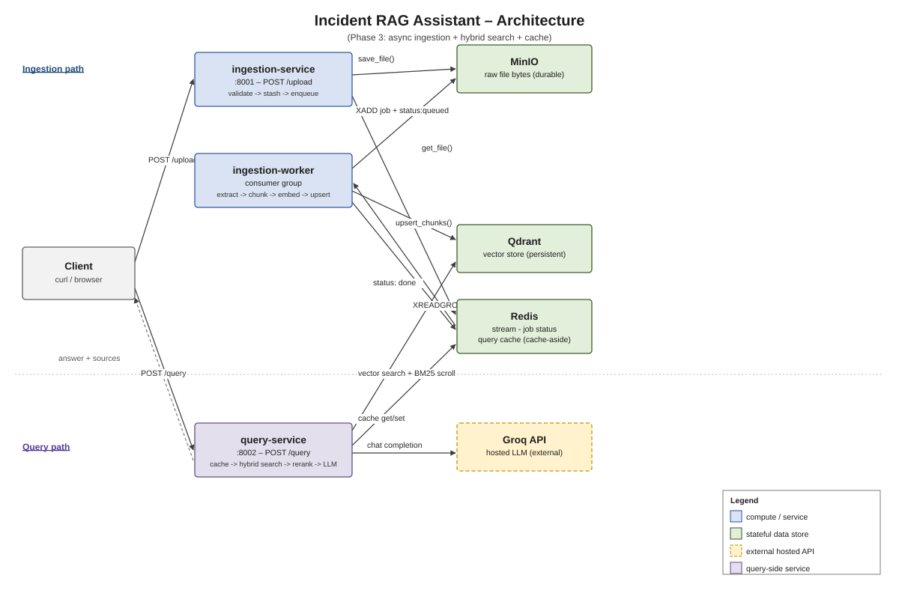

# Architecture — Incident RAG Assistant

This document is the deep-dive companion to the [README](./README.md): not just what
the system does, but what happens on every request, and the actual reasoning (and a
couple of real mistakes) behind every non-obvious technical choice.

## System overview

| Service | Port | Role |
|---|---|---|
| `ingestion-service` | `:8001` | Accepts uploads, validates them, stashes the raw file, enqueues a job. Never blocks on processing. |
| `ingestion-worker` | — | Consumes ingestion jobs: extract → chunk → embed → upsert. Runs as its own process (or inline in `ingestion-service` behind a flag — see below). |
| `query-service` | `:8002` | Answers questions: cache check → hybrid retrieval → rerank → LLM generation. |
| Qdrant | `:6333` | Persistent vector store for chunk embeddings. |
| Redis | `:6379` | Three jobs at once: the ingestion job stream, per-document status, and the query answer cache. |
| MinIO | `:9000` / `:9001` (console) | S3-compatible object storage for raw uploaded files. |
| Groq (external) | — | Hosted LLM inference (`llama-3.3-70b-versatile`) for answer generation. |

## Step by step: ingestion

1. `POST /upload` hits `ingestion-service` (`app/main.py`). The file is read into
   memory and checked against `is_supported()` (`app/extract.py`) — only
   `.pdf`, `.docx`, `.txt`, `.md`.
2. A `document_id` (`uuid4`) is generated. The raw bytes go straight to MinIO via
   `save_file()` (`app/storage.py`), which lazily creates the `raw-documents`
   bucket the first time and `put_object`s the file under
   `{document_id}/{filename}`.
3. `set_status(document_id, "queued", ...)` writes a Redis hash `status:{document_id}`.
4. `enqueue_job()` (`app/queue.py`) does `XADD ingestion_jobs {...}` — pushes the job
   onto a Redis Stream — and the endpoint returns immediately with
   `{document_id, status: "queued"}`. Total request time: however long it takes to
   read the file and write it to MinIO, nothing more. No extraction, chunking, or
   embedding happens on this request.
5. Separately, `ingestion-worker` (`app/worker.py`) runs `ensure_group()` once at
   startup — `XGROUP CREATE ingestion_jobs ingestion_workers` — then loops on
   `XREADGROUP GROUP ingestion_workers ... BLOCK 5000`, pulling one job at a time.
6. For each job: `set_status(..., "processing")` → `get_file()` pulls the raw bytes
   back out of MinIO → `extract_text()` (PyMuPDF for PDF, `python-docx` for DOCX,
   plain UTF-8 decode for txt/md) → `chunk_text()` (`app/chunking.py`) → `embed_texts()`
   (`app/embeddings.py`) → `upsert_chunks()` (`app/vector_store.py`).
7. Only after all of that succeeds does the worker `XACK` the message. If the worker
   crashes mid-job, the message stays in the stream's pending-entries list,
   unacknowledged — Redis Streams' consumer-group model, not something bolted on.
8. If `process_job()` raises anywhere in that chain, the `except` block sets status
   to `"failed"` with the error message — **but the message still gets `XACK`'d** in
   `run()` regardless of success or failure. That's a real, current gap: a failed
   job does not automatically retry. Today, recovering means re-uploading. Worth
   knowing before someone asks "what happens if extraction throws" in an interview.

**Chunking specifics**: `chunk_text()` is a fixed-size sliding window over
whitespace-split words — `chunk_size=800` words, `chunk_overlap=150`, so it steps
forward 650 words at a time. It's not sentence- or paragraph-aware; it's the
simplest thing that gives every chunk meaningful overlap with its neighbors, so an
answer that straddles a chunk boundary doesn't lose context entirely.

## Step by step: query

1. `POST /query {question}` hits `query-service` (`app/main.py`).
2. `get_cached()` (`app/cache.py`) normalizes the question (strip, lowercase,
   collapse whitespace), SHA-256 hashes it, and does a Redis `GET
   query_cache:{hash}`. **On a hit, everything below is skipped** — no retrieval,
   no rerank, no LLM call — and the response comes back with `cached: true`.
3. On a miss, `retrieve()` (`app/retrieval.py`) runs two searches in parallel logic
   (not concurrently, but independently):
   - **Vector search**: embed the question with the same `sentence-transformers`
     model used at ingestion time, `query_points` against Qdrant for the top
     `hybrid_candidates` (20) nearest neighbors by cosine similarity.
   - **BM25 keyword search** (`app/bm25_index.py`): scores the question against an
     in-process `rank_bm25.BM25Okapi` index. That index is rebuilt from Qdrant every
     `bm25_refresh_seconds` (30s) by **scrolling the entire collection** — not
     incremental. The code says so directly in a comment: fine at this dataset
     size, would need a real inverted index (e.g. Elasticsearch/OpenSearch) or
     incremental updates at real scale.
4. The two candidate lists are merged and deduped on `(document_id, chunk_index)`.
5. `rerank()` (`app/rerank.py`) runs a **cross-encoder**
   (`cross-encoder/ms-marco-MiniLM-L-6-v2`) over every `(question, chunk_text)` pair
   in the merged candidate set and takes the top `top_k` (5). This is a different
   kind of model than the embedding step — it looks at the question and the chunk
   *together*, with full attention across both, rather than comparing two
   independently-computed vectors. Slower per pair, but it's only run over ~20-40
   candidates, not the whole corpus.
6. `generate_answer()` (`app/llm.py`) builds a context block from the top-5 chunks
   (each tagged with its source filename and chunk index), and calls Groq's
   OpenAI-compatible chat completions endpoint with a system prompt that says,
   explicitly: answer *only* from the given context, say so if the context doesn't
   have the answer, cite the source file. That instruction is the only thing
   standing between this and a chatbot that confidently makes things up.
7. On success, the answer and its sources are written to Redis with `SETEX ... 3600`
   (1 hour TTL) before the response goes back — so the *next* identical question,
   from anyone, skips the entire pipeline above.
8. If Groq's API throws, `main.py` catches `openai.APIError` specifically and
   returns **HTTP 502**, not a generic 500 — telling the caller "the upstream
   provider failed," not "our code broke."

## The thought process — every non-obvious decision, and why

### Why split into `ingestion-service` / `ingestion-worker` / `query-service` instead of one app
Ingestion and query have opposite resource profiles. Ingestion is bursty and
CPU-heavy (embedding a whole document at once); query needs to stay
latency-sensitive and available *even while* a large document is being ingested.
In a monolith, a big upload would slow down or block someone's question. Splitting
them means each can be scaled independently, and a slow ingestion job can never
degrade query latency.

### Why async ingestion (Phase 2) instead of keeping `/upload` synchronous
Phase 1 did everything inline: extract, chunk, embed, upsert, all before the HTTP
response went back. That's fine for a one-page text file and painfully slow for a
50-page PDF, holding the connection open the whole time with no feedback. Moving
extraction off the request path via a queue means `/upload` returns in
milliseconds with a `document_id` to poll, and the actual work happens on the
worker's own schedule. The real cost of this is eventual consistency — a
just-uploaded document isn't searchable for a few seconds — which is an easy trade
for a responsive API.

### Why Redis Streams with a consumer group, not pub/sub, not Kafka/RabbitMQ
Plain Redis pub/sub has no durability — if nothing is subscribed at publish time,
the message is just gone. A consumer group fixes exactly that: an unacknowledged
message sits in the group's pending-entries list until it's explicitly `XACK`'d, so
a worker crash doesn't silently drop a job. Kafka or RabbitMQ would give the same
durability guarantee and then some (multiple consumer groups, partitioning,
replayable history) — real value at a scale this project isn't at yet. Redis was
already a hard dependency for status tracking and the query cache, so reusing it
for the job queue avoids standing up a fourth piece of infrastructure to solve a
problem Redis already solves well enough.

### Why Qdrant, not FAISS
FAISS is a library, not a service — it runs in-process, in memory. That means no
persistence across restarts unless you build your own save/load layer, no
network API for other services to hit, and no built-in way to filter search
results by metadata. It's excellent for a notebook experiment or a single-process
prototype. It is not what you reach for when the vector index needs to survive a
container restart and be queried by a separate service over the network — which is
exactly the situation here, since `ingestion-worker` writes vectors and
`query-service` reads them, as two different processes. Qdrant runs as its own
persistent service with a real client API, survives restarts because its data is
on a mounted volume, and comes with payload filtering and horizontal scaling built
in. That's the actual meaning of "production scale" here: not raw search quality
(FAISS's algorithms are perfectly good), but operability — durability, a network
boundary, and being usable by more than one process.

### Why local embeddings (`sentence-transformers`) but a hosted LLM for generation
Embeddings run on *every single chunk at ingestion* and *every single question at
query time* — by far the highest-volume operation in the system. Running that
locally means no per-call cost, no network round-trip on the query hot path, and no
rate limit to worry about for the part of the system that fires most often.
Generation is the opposite: one call per question, not per chunk, so it can afford
to be a hosted API — and a hosted API gets a vastly more capable model (70B
parameters) than would be practical to self-host for free. Split the workload by
call volume, not by "which is more important."

### Why hybrid search (vector + BM25), not vector-only
Embeddings are good at semantic similarity and bad at exact tokens — error codes,
service names, ticket IDs, specific jargon that shows up verbatim in runbooks and
postmortems. Two embeddings for "503 error" and "502 error" can end up close
together in vector space even though they mean different things operationally.
BM25's exact term-frequency matching catches precisely what embeddings blur. For an
*internal engineering knowledge base* specifically — the actual use case this
project targets — queries are disproportionately full of exact identifiers, which
is the case vector-only retrieval handles worst.

### Why a cross-encoder rerank step, instead of trusting the raw scores
Vector cosine similarity and BM25 scores live on completely different,
mathematically incomparable scales. There's no principled way to merge-sort two
candidate lists ranked by two unrelated scoring functions. A cross-encoder sidesteps
that by not comparing scores at all — it looks at each `(question, chunk)` pair
jointly and outputs one relevance score per pair, on one consistent scale, which is
what actually decides final order. The cost is that it's slower per item than a
vector comparison, which is exactly why it only runs over the ~20-40 already-merged
candidates instead of the whole corpus.

### Why cache-aside with Redis, keyed on a normalized+hashed question
A full query — embed, vector search, BM25 rebuild-or-reuse, rerank, LLM call — is
the most expensive path in the system. In an internal knowledge base, the same
incident gets asked about by multiple people in a short window. Normalizing
(strip/lowercase/collapse whitespace) before hashing means trivially different
phrasings of the same question still hit the same cache key. The tradeoff is a
1-hour staleness window — if the underlying docs change, a cached answer could be
out of date for up to an hour. Acceptable for how often the knowledge base actually
changes; would need cache invalidation on re-ingestion to do better.

### Why MinIO for raw files, not S3 directly, not just a Redis blob
Raw files only need to survive the handoff from `/upload` to whenever the worker
picks the job up — but "handoff" isn't always short, and losing the source file
because it expired out of a TTL'd cache is a real failure mode, not a
hypothetical one. Object storage is built for exactly this: large binary blobs with
content-type metadata, no arbitrary size pressure the way an in-memory cache has.
MinIO specifically, over some other object store, because it speaks the S3 API —
the same client code (`boto3`-compatible / MinIO's SDK) points at real AWS S3 with
zero code changes, just different endpoint and credentials. That portability is the
actual point, not "any object store would do."

**The honest version of this decision** (worth having ready for an interview,
because it's a better story than a clean straight line): MinIO was dropped for one
commit, specifically to fit a fully-free hosting deploy — self-hosting Qdrant,
Redis, *and* MinIO is a lot of stateful infrastructure for typical free tiers, so
raw files were moved to a short-TTL Redis key to remove one whole piece of infra.
That version worked, but the free hosting target for the *rest* of the stack didn't
pan out anyway — so the trade bought nothing, and MinIO went back in. That's a
decision made for a specific constraint, and reversed once that constraint's payoff
didn't materialize — a fine answer to "tell me about a decision you reversed."

### Why Groq running `llama-3.3-70b-versatile`, not Gemini
Development started against Gemini and kept running into its free-tier rate
limits — request volume during iteration (re-running the same queries while tuning
retrieval) exceeded what the free tier allowed, which stalls a build, not just a
demo. Groq's free tier held up much better under the same usage pattern, and
Groq's inference is unusually fast (their LPU hardware is built specifically for
low-latency inference), which matters here because generation is on the
user-facing request path — a slow LLM call is directly a slow `/query` response.
`llama-3.3-70b-versatile` specifically, over a smaller/faster Groq-hosted model, is
a quality call: the system prompt's grounding instruction ("answer only from
context, say so if you don't know") is exactly the kind of instruction smaller
models are more prone to ignoring under pressure to just answer something. 70B
follows it more reliably, and since retrieval already narrows the LLM's job down to
"synthesize an answer from five short chunks" rather than "reason over a huge
context," the extra model size doesn't cost as much latency as it would on a longer
task.

### Rate limiting — the honest state of it
There is currently **no explicit rate-limiting or retry/backoff logic in the code**
— no `tenacity`, no `backoff`, no retry loop around the Groq call in `llm.py`. This
is worth stating plainly rather than glossing over, because it's an easy follow-up
question. What actually reduces call pressure today is architectural, not a rate
limiter: the Redis cache-aside layer means repeat questions never reach the LLM at
all, and choosing Groq over Gemini was itself a response to hitting limits, not a
mitigation built into the system. A production version of this would wrap the Groq
call in retry-with-exponential-backoff on 429s (`tenacity` is the standard choice
here), and would need the same treatment on the embedding model calls if they ever
moved to a hosted API instead of running locally.

## Known limitations (say these before you're asked)

- **Failed ingestion jobs don't retry.** The worker acknowledges the stream message
  whether `process_job()` succeeds or raises. A failed upload requires a manual
  re-upload today.
- **BM25 rebuild is O(collection size) on a timer**, not incremental. Scrolling the
  whole Qdrant collection every 30 seconds to rebuild an in-memory index is fine at
  a few hundred chunks and would not scale to a large knowledge base.
- **No rate limiting or retry/backoff** on the Groq call (see above).
- **No auth, no multi-tenancy.** Anyone who can reach the services can upload or
  query. Fine for an internal single-team tool as built; not fine beyond that.
- These aren't oversights being hidden — they're exactly what Phases 4-6 in the
  README's roadmap (observability, evaluation, cloud deploy with auth) are for.

## A real bug, for the "tell me about a bug you fixed" question

Commit history has an authentic one: `ingestion-service`'s `main.py` has a
`run_worker_inline` option (run the worker loop in a background thread instead of a
separate process, for deploy targets where a second long-running service isn't
free). The lifespan code referencing `settings.run_worker_inline` got pushed before
the corresponding field was actually added to `config.py` — it existed only in an
uncommitted local edit. The deployed service crash-looped with an `AttributeError`
on every startup. The fix path was: add diagnostic logging around the inline
worker startup first (to confirm exactly where it was failing), then add the
missing config field once the logs confirmed the cause. A small bug, but a
realistic one — local vs. pushed state drifting apart — and a clean example of
logging-first debugging rather than guessing.
